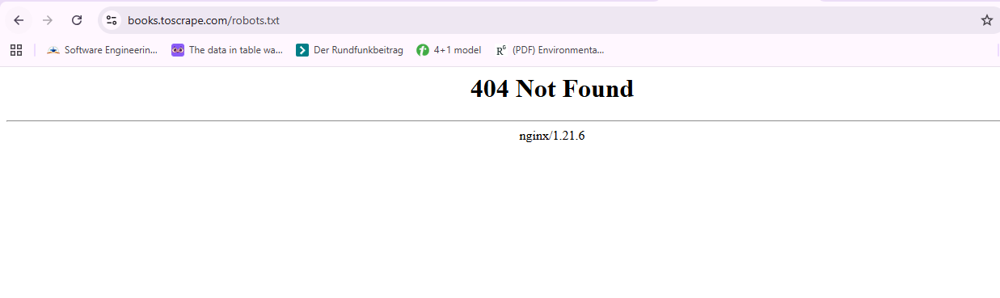
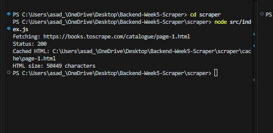
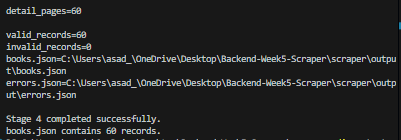

# Books to Scrape – Scraper

## Target Classification

The target website for this assignment is:

https://books.toscrape.com/

Books to Scrape is a practice catalogue website containing book listings that can be collected for this scraping exercise.

### Target Type

- HTML catalogue website
- Book listing pages
- Paginated catalogue
- Product/book detail pages
- The scraper will collect structured information from the catalogue pages.

### Robots.txt Check

The following URL was requested once before starting the scraper:

https://books.toscrape.com/robots.txt

Result:

**404 Not Found**

The target did not provide a `robots.txt` file at this location, so no robots.txt rules were available to interpret from this request.

### Scraping Scope

The scraper will only access the assigned target:

https://books.toscrape.com/

No unrelated websites or targets will be accessed.

## Evidence

### robots.txt Request

The target's `robots.txt` URL returned a 404 response.




## Stage 1 – Fetch and Cache

The scraper fetches the first catalogue page from:

https://books.toscrape.com/catalogue/page-1.html

The request uses a descriptive User-Agent and checks the HTTP response status before processing the response.

The returned HTML is cached locally as:

`cache/page-1.html`

The cached file is excluded from Git using `.gitignore`.

### Evidence



## Stage 2 – Catalogue Discovery

The scraper parses the catalogue pages using Cheerio and follows the
website's own "Next" pagination link.

Book links are discovered from the first three catalogue pages.
Relative links are converted to absolute URLs using the `URL` API.

Duplicate URLs are removed before continuing.

### Results

```text
catalogue_pages=3
discovered=60
unique_urls=60
```


## Stage 3 – Extract Book Details

The scraper visits each of the 60 unique book detail pages discovered
during Stage 2.

Each detail page is cached locally and parsed using Cheerio.

The raw record contains:

- title
- product_url
- price_text
- availability_text
- rating_text
- description
- source_page
- fetched_at
- upc

The scraper successfully extracted all 60 book detail pages.

### Results


## Stage 4 – Normalize and Validate

The raw book records from Stage 3 are normalized into a consistent
schema and validated before being written to JSON.

Normalization includes:

- Converting GBP price text into a numeric `price_gbp` value
- Converting rating words into integers from 1 to 5
- Converting availability text into `in_stock` and `count`
- Preserving missing descriptions as `null`
- Ensuring product URLs are absolute HTTPS URLs
- Checking for duplicate product URLs

Validated records are written to `output/books.json`.

Validation errors are written to `output/errors.json`.

### Results




## Stage 5 – Failure Handling and Run Reporting

The scraper handles individual page failures without terminating the
entire run.

### Failure Handling

- HTTP 5xx errors are retried once.
- Request timeouts are retried once.
- HTTP 403 and 404 errors are not retried.
- If a page still fails, it is skipped and recorded in the run report.
- Remaining pages continue to be processed.

### Run Report

Each run generates:

```text
output/run-report.json
```


